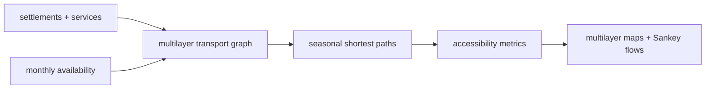
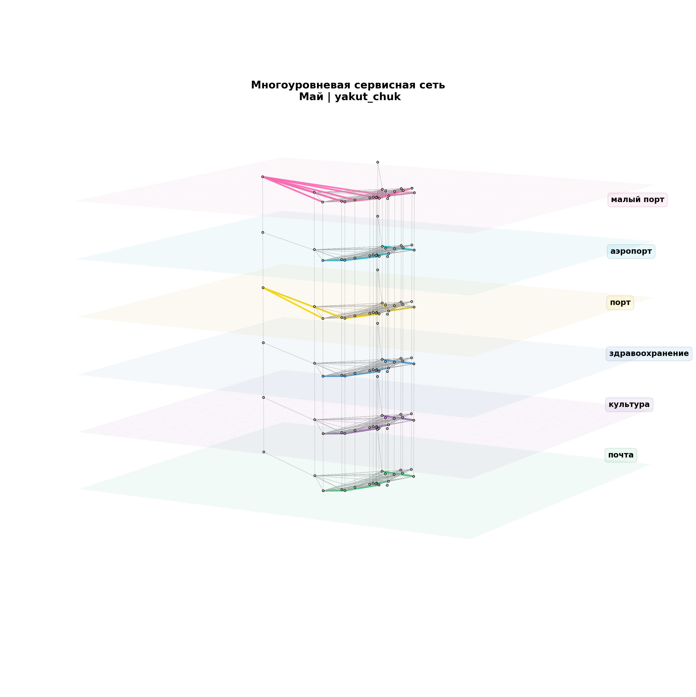

# arctic_access

Seasonal multilayer accessibility model for Arctic settlements. The repo compares how service reachability changes when river/sea/road/air layers open or close by month.

## System Map



## Main Result



## Run

Entrypoint: `notebooks/2_main.ipynb`

Human:

```bash
jupyter notebook notebooks/2_main.ipynb
```

Agent: check raw/processed data first, then inspect the generated multilayer maps and flow plots directly.

## Publication

Related paper PDF is in `../itmo-phd-thesis-template-en/Dissertation/publications/01_environment_framed_networks.pdf`.

## Next Steps / Heuristics

Heuristic: seasonal transport modes are explicit graph layers. Missing or duplicated routes should be reported as model output, not hidden by fallback routing.
