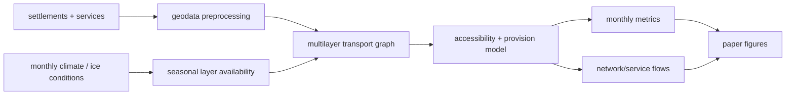

# arctic_access

[](https://github.com/aimclub/OSA)

Seasonal multilayer accessibility model for Arctic settlements. The repository is a notebook-driven research workflow: it prepares settlement/service layers, builds monthly multimodal transport graphs, estimates service provision, and renders thesis/paper figures for Arctic accessibility analysis.

## System Map



## Main Result


## Run

Entrypoint: `notebooks/2_main.ipynb`

Human:

```bash
pip install -r requirements.txt
jupyter notebook notebooks/2_main.ipynb
```

Agent: check that processed inputs under `../data/` exist first, then run/inspect the notebook outputs and visually verify regenerated figures in `plots/`.

## OSA Notes

OSA was run on this repository for README/metadata cleanup. Its generated README sections were reviewed and kept only where they matched the actual project; broken local placeholder links and unsafe dependency rewrites were removed.

## Publication

Related paper PDF is in `../itmo-phd-thesis-template-en/Dissertation/publications/01_environment_framed_networks.pdf`.

Repository citation metadata is in `CITATION.cff`.

## Next Steps / Heuristics

- Seasonal transport modes are explicit graph layers; do not hide missing or duplicated routes behind fallback routing.
- Keep monthly assumptions visible in the notebook and figure names.
- Prefer inspecting final PNGs in `plots/` over trusting notebook completion.
- If requirements are regenerated, compare against the current full geospatial stack before replacing the pinned file.
