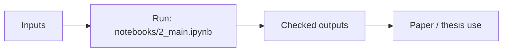

# arctic_access

Seasonal multilayer service accessibility for Arctic settlements.

## Scheme



## Main Result


## Run

Entrypoint: `notebooks/2_main.ipynb`

Human:

```bash
jupyter notebook notebooks/2_main.ipynb
```

Agent:

Run only after checking raw/processed data availability; inspect generated plots, not only notebook completion.

## Publication

See thesis publication bundle in `itmo-phd-thesis-template-en/Dissertation/publications/`.

## Next Steps / Heuristics

Heuristic: seasonal modes are explicit layers; report missing/duplicate routes honestly.
